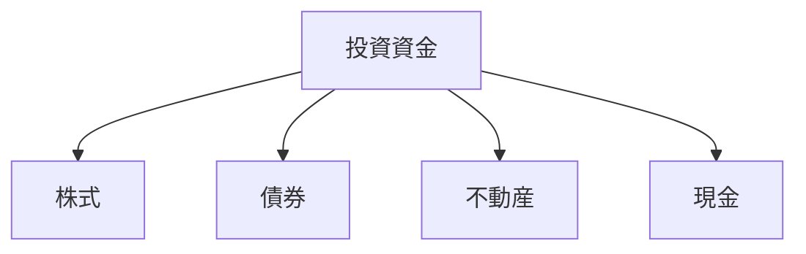

# News の話

## 1. 予算の立て方

効果的な予算管理は、財務の健全性を保つ上で重要です。以下のステップに従って、適切な予算を立てましょう。

:::message
予算管理は、将来の経済的安定性を確保するための第一歩です。
:::

### 収入の把握

```js
const monthlyIncome = salary + sideIncome + investmentReturns;
```

- 給与収入
- 副収入
- 投資収益

### 支出の分類

| 種類   | 例           | 特徴     |
| ------ | ------------ | -------- |
| 固定費 | 家賃、光熱費 | 毎月一定 |
| 変動費 | 食費、交通費 | 調整可能 |
| 娯楽費 | 趣味、外食   | 自由度高 |

## 2. 貯金の方法

:::message alert
緊急用資金は、最低でも月収の 3 倍は確保しましょう！
:::

### 自動貯金

毎月の収入から一定額を自動的に貯金口座に振り替えることで、確実な貯金習慣を身につけることができます。

### 目的別貯金

- 緊急用資金（3-6 ヶ月分の生活費）
- 老後資金
- 特定の目標のための貯金

## 3. 投資の基本

### 分散投資の重要性

リスクを軽減するために、複数の資産クラスに分散投資することが重要です。



### 長期投資の利点

- 複利効果の活用
- 市場変動リスクの軽減
- 税制上の優遇措置

## 4. 債務管理

### クレジットカードの使用

- 支払能力の範囲内での利用
- ポイント活用の戦略
- 返済計画の重要性

### 借入金の管理

- 金利の比較
- 返済計画の作成
- 繰り上げ返済の検討
